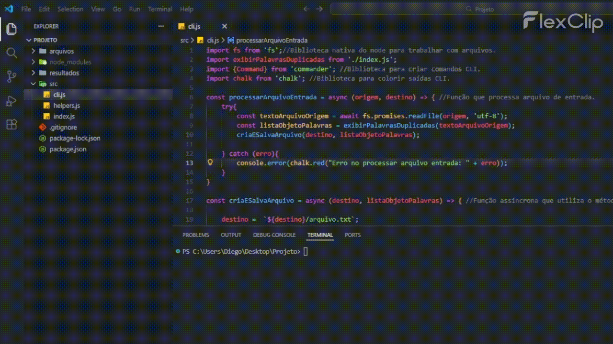

<h1>Titulo ou Arte do Projeto</h1> 

> Status do Projeto: :heavy_check_mark:

### Tópicos

:small_blue_diamond: [Descrição do projeto](#descrição-do-projeto)

:small_blue_diamond: [Funcionalidades](#funcionalidades)

:small_blue_diamond: [Pré-requisitos](#pré-requisitos)

:small_blue_diamond: [Como rodar a aplicação](#como-rodar-a-aplicação-arrow_forward)

## Descrição do projeto 

<p align="justify">
  O projeto consiste em gerar um relatório txt exibindo em quais parágrafos contém repetição de palavras, ajudando os dissertadores de redação a terem melhor noção de seus vícios de linguagem e melhorar a escrita.
</p>

## Funcionalidades

:heavy_check_mark: Textos de qualquer comprimento é aceito, desde que esteja no formato txt.

:heavy_check_mark: Após passado o texto para análise, é gerado um novo relatório txt que exibe onde contém repetições.

## Pré-requisitos

:warning: [Node](https://nodejs.org/en/download/)

:warning: [Commander.js](https://www.npmjs.com/package/commander)

:warning: [chalk](https://www.npmjs.com/package/chalk)

## Como rodar a aplicação :arrow_forward:

No terminal, clone o projeto:
```
git clone git@github.com:mininoterraria/Relator-Palavras-Duplicadas.git
```
Instale as bibliotecas necessárias:
```
npm install commander
npm install chalk
```
Utilize o seguinte comando para gerar o relatório para detectar as repetições de palavra do texto:
```
node src\cli.js -o arquivo_para_ser_lido d- destino_relatorio_gerado
```




